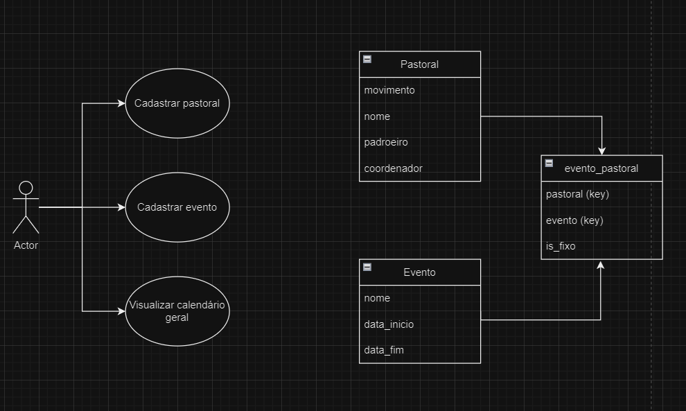

# Sistema de gerenciamento de pastorais
## 1. Tema e objetivo: 
    Garantir facilidade para o gerenciamento das pastorais de uma paróquia e seus eventos, bem como para obter dados para a montagem do calendário paroquial.

## 2. Funcionalidades:
    - cadastro de pastorais e movimentos;
    - cadastro de eventos;
    - exibição de calendário geral dos eventos.

## 3. Entidades:
    - Pastoral;
    - Evento;
    - Evento_Pastoral.

## 4. Diagramação:

## 5. Prototipação:
Clique [aqui](https://www.figma.com/file/ooJdHii5fNW4Jjns3ZC9PE/Gerenciador-de-Pastorais?type=design&node-id=302%3A58&mode=dev) para visualizar os protótipos de telas no Figma.
